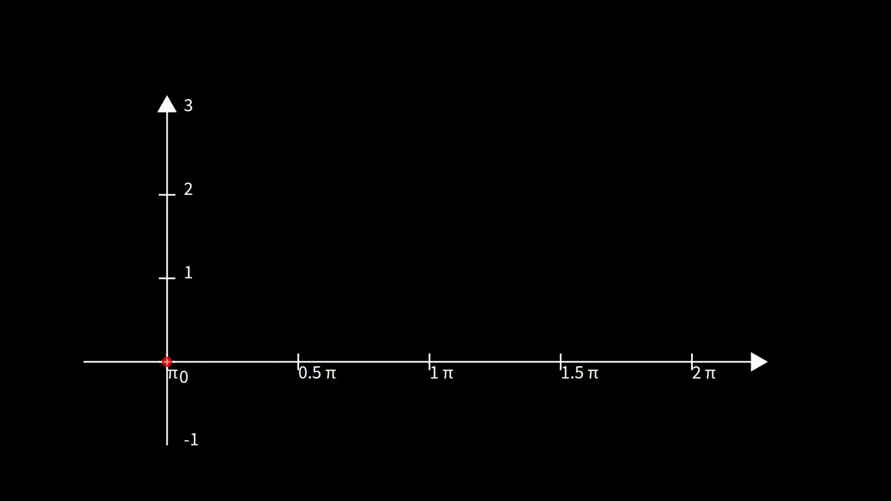
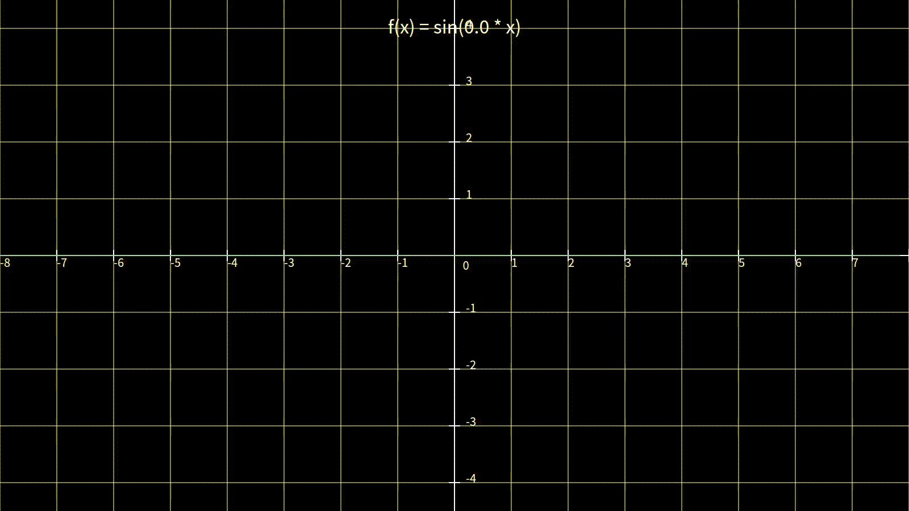
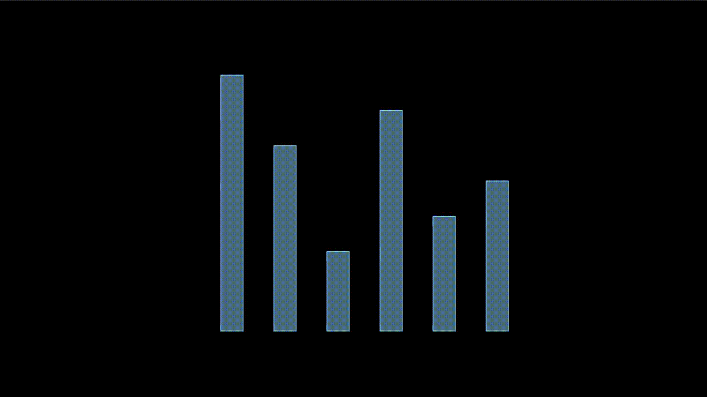
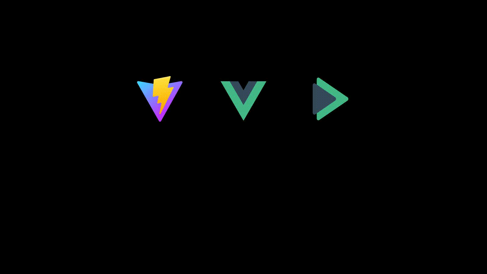

<div align="center">
  
  <h1>VueMotion</h1>
  <span>The next generation animation engine for Vue ecosystem.</span>
</div>

# 📒 Introduction

VueMotion is a modern animation engine like Python's Manim for Vuejs ecosystem, it provide lots of widget to help users produce animation and video rapidly. And it has a high scalability, which means you can easily create you own animation style.

VueMotion's predecessor was the Newcar animation engine, but later the development was stopped for some special reasons. If you are an old user of Newcar, you are welcome to migrate to VueMotion.

# 🎥 Demos

<table>
  <tr>
    <td></td>
    <td></img></td>
    <td></img></td>
  </tr>
  <tr>
    <td colspan="1.5"></td>
    <td colspan="1.5"></td>
  </tr>
</table>

# 📚 Documentation

The documentation has been available at [vuemotion.dev](https://vuemotion.dev)

# 📖 Tutorial

You can use our client tool to rapidly create a animation video via VueMotion.

```shell
$ npm install -g @vue-motion/client
$ vuemotion create my-animation-project
$ cd my-animation-project
$ npm install
$ npm run start
```

You will see the animation has been put in our previewer.

To export the animation, you can use the following command:

```shell
$ vuemotion export 3
```

It will generate a video file named `output.mp4` in the current directory. The length of the video is 3 seconds.

# 📝 License

vue-motion is licensed under the Apache-2.0 License. See the [LICENSE](./LICENSE) file for details.

**_Copyright 2024-present, BugDuck Team._**

# 🧑‍💻 More Info

💖 Maintained with LOVE by:

- [@BugDuck](https://github.com/Bug-Duck)

👥 Core Team Members:

- [@sheepbox8646](https://github.com/sheepbox8646)
- [@Howardzhangdqs](https://github.com/Howardzhangdqs)
- [@cxzlw](https://github.com/cxzlw)
- [@xiaodong2008](https://github.com/xiaodong2008)
- [@jiwangyihao](https://github.com/jiwangyihao)
- [@xs10l3](https://github.com/xs10l3)

🙏 Thanks for Their Accompanying:

- [@samzhangjy](https://github.com/samzhangjy)
- [@onion108](https://github.com/onion108)
- [@hydrati](https://github.com/hydrati)
- [@tomoriny](https://github.com/tomoriny)
- [@montmorill](https://github.com/montmorill)
- [@KermanX](https://github.com/KermanX)

🫶 Thanks for These Organizations:

- [@dromara](https://github.com/dromara)
- [@vuejs](https://github.com/vuejs)
- [@vitejs](https://github.com/vitejs)
- [@OpenTeens](https://github.com/OpenTeens)

💪 Sponsors

- [PagePeek](https://pagepeek.ai)

🌐 Social Media

- [X(Twitter)](https://x.com/bugduckteam)
- [Discord](https://discord.gg/PUVcpkv8)
- [Bilibili (For 🇨🇳 Users)](https://space.bilibili.com/1959824394)
